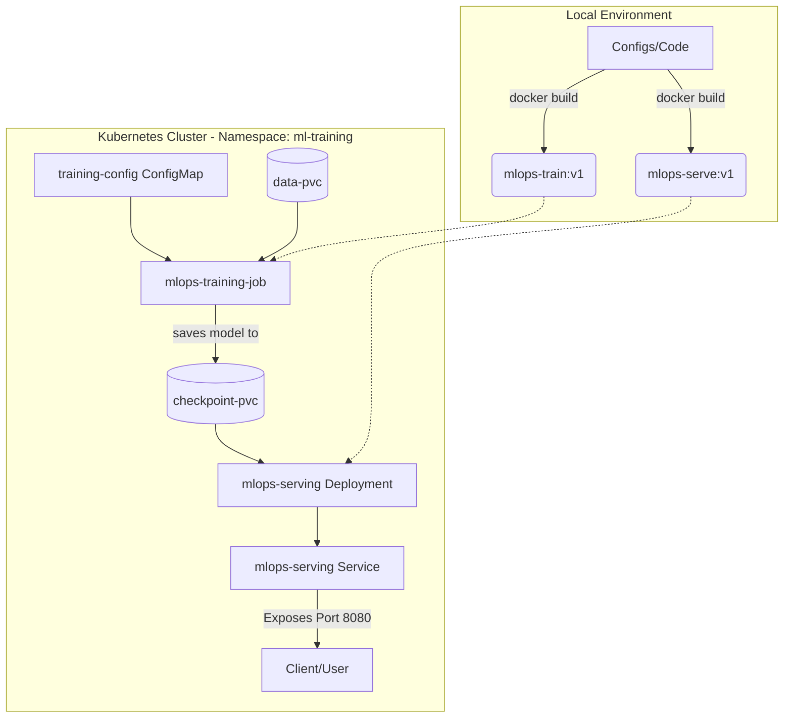

# MLOps PyTorch Pipeline Assignment

This repository contains the complete MLOps pipeline for training and serving a PyTorch CNN model on the CIFAR-10 dataset using Docker and Kubernetes.

## Architecture

Here is the high-level architecture of the system:



## Project Structure

- `src/`: Contains the core Python code (`model.py`, `train.py`, `dataset.py`, `serve.py`).
- `docker/`: Contains the Dockerfiles for both training and serving environments.
- `k8s/`: Contains the Kubernetes manifests for deploying the pipeline.
- `configs/`: YAML configuration for training hyperparameters.
- `tests/`: Basic unit tests.

## Step-by-Step Setup Instructions

Follow these steps to run the pipeline from scratch on a local machine with Docker Desktop (ensure Kubernetes is enabled in settings).

### 1. Build the Docker Images

First, build the training and serving images locally. We build them with the `:v1` tag so Kubernetes can pull them from the local cache.

```bash
docker build -f docker/Dockerfile.train -t mlops-train:v1 .
docker build -f docker/Dockerfile.serve -t mlops-serve:v1 .
```

### 2. Prepare the Data

Before running the Kubernetes job, we need to populate the data persistent volume. We can do this by running a quick local container to download the CIFAR-10 data to a mounted local folder. (Alternatively, the training script will download it automatically if it's missing, but pre-downloading prevents network timeouts).

```bash
# Optional: test training locally and cache data
docker run --rm -v ${PWD}/data:/app/data -v ${PWD}/checkpoints:/app/checkpoints mlops-train:v1
```

### 3. Deploy to Kubernetes

Now apply all the Kubernetes manifests. Make sure to apply the namespace and PVCs first before the jobs.

```bash
# Create namespace
kubectl apply -f k8s/namespace.yaml

# Create ConfigMap and PVCs
kubectl apply -f k8s/configmap.yaml
kubectl apply -f k8s/pvc.yaml

# Start the training job
kubectl apply -f k8s/training-job.yaml
```

### 4. Monitor Training

You can check the status of the training job using:

```bash
kubectl get pods -n ml-training
```

Once the pod is running, check the logs to see the training progress:
```bash
# Replace with your actual pod name
kubectl logs -f pod/mlops-training-job-xxxxx -n ml-training
```

### 5. Deploy the Serving API

Once the training job completes and the `classifier_v1.pt` checkpoint is saved to the PVC, deploy the serving API:

```bash
kubectl apply -f k8s/serving-deployment.yaml
kubectl apply -f k8s/serving-service.yaml
```

Wait for the serving pods to become ready:
```bash
kubectl get pods -n ml-training
```

### 6. Test the API

Now you can test the model inference by port-forwarding or using the exposed NodePort (if configured).

First, check the health endpoint:
```bash
curl http://localhost:8080/health
```

Then, send a prediction request with dummy data:
```bash
curl -X POST http://localhost:8080/predict -H "Content-Type: application/json" -d "{\"data\": [[0.5, 0.5, 0.5]]}"
```

## Notes on Hardware Issues

During development, we encountered a few environment-specific challenges that are worth documenting:
1. **Institute Server DiskPressure**: The remote server ran out of disk space, which prevented Kubernetes pods from scheduling.
2. **WSL2 Memory Fragmentation**: When running locally on Windows Docker Desktop, we encountered `Exit Code 139` (Segmentation Fault). This happens because PyTorch consumes significant RAM, and running it alongside Kubernetes caused WSL2 to run out of memory. 

**Fix:** We fixed this by limiting the model to a lightweight CNN (`tinycnn`), increasing the `.wslconfig` memory to 6GB+, and fully restarting Docker Desktop.
